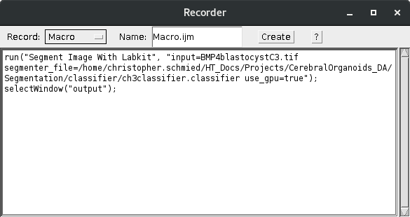

# DL4MIA 2023: 05b - Accelerated image labeling with Labkit

Paper: [https://www.frontiersin.org/articles/10.3389/fcomp.2022.777728/full](https://www.frontiersin.org/articles/10.3389/fcomp.2022.777728/full)

Extensive documentation and tutorials provided here: [https://imagej.net/plugins/labkit/](https://imagej.net/plugins/labkit/).

I2K talk with a quick demo: [https://youtu.be/UZjZtmm7adU](https://youtu.be/UZjZtmm7adU)

## **Learning Objectives**

- Use sparse labels and random forest pixel classification
- Extract segmentation and use them further with Fiji
- Reload automatically generated labels for curation with Labkit

## Prerequistes

- Manual image **labeling with Labkit:**

    [Manual image **labeling with Labkit**](https://www.notion.so/Manual-image-labeling-with-Labkit-7f3180be90b24664b3218f0fec78d780)

- Basic understanding of Fiji
- Install Labkit in Fiji
- Use the Labkit interface
- Load an example data set:

    [https://bbbc.broadinstitute.org/BBBC032](https://bbbc.broadinstitute.org/BBBC032)

# Introduction

This tutorial describes a method for an accelerated ground truth generation. This process first involves the automatic generation of a segmentation using a random forest pixel classification in Labkit. This segmentation is then reloaded as a label into Labkit. This allows to then generate the ground truth by curating the automatic segmentation.

**IMPORTANT:** the output of the initial automatic segmentation of Labkit does not constitute ground truth! Only a careful vetting and curation is able to generate ground truth.

# **Exercise #1 Train a classifier**

Load the example data with labkit ([https://bbbc.broadinstitute.org/BBBC032](https://bbbc.broadinstitute.org/BBBC032)). Unzip the data and then use channel 3: **BMP4blastocystC3.tif**

Open the example dataset in Fiji by ***drag & drop***.

**NOTE:** If your data is a multichannel image and you only want to train a model on 1 channel then split channels before loading the data (***Image > Color > Split Channels)***. The pixel classifier would otherwise use all the available channels for training. Then select the channel you want to train the pixel classifier on.

Load the image volume into Labkit:

***Plugins > Labkit > Open Current Image in Labkit***

Make sure you are in the 3D mode:

[https://lh5.googleusercontent.com/SUicCzhxVAN6Yp8SxPt5Y164J7MvX4igbS7UB1en4uy_yss6I3_HfmuEarX8ubFjoZPDvNMwJXqnc-BN9rNhkx9t4txiSgacfT0RoqyYrpJ4UMTHMXtDDjHdmw2zrEcYhXv59v1vebgcIjUhXJQd3RE](https://lh5.googleusercontent.com/SUicCzhxVAN6Yp8SxPt5Y164J7MvX4igbS7UB1en4uy_yss6I3_HfmuEarX8ubFjoZPDvNMwJXqnc-BN9rNhkx9t4txiSgacfT0RoqyYrpJ4UMTHMXtDDjHdmw2zrEcYhXv59v1vebgcIjUhXJQd3RE)

Select the labeling class on the left side you want to generate the sparse labels for. Then draw on the canvas**:**

[https://lh5.googleusercontent.com/9brddazFrd_4ClQB-CHzTlsDSwJ8rVDq0F7Xtpdub746bL2w3LXr-dIPhwAEMbxiko7CuOPh0KnLD6-t7X7KjLVbL7DXyzcoE7Z6hePSdhB33i9CbqKJnh25Nk1i0g7CV_R9SthENPx-ff0M4uakGas](https://lh5.googleusercontent.com/9brddazFrd_4ClQB-CHzTlsDSwJ8rVDq0F7Xtpdub746bL2w3LXr-dIPhwAEMbxiko7CuOPh0KnLD6-t7X7KjLVbL7DXyzcoE7Z6hePSdhB33i9CbqKJnh25Nk1i0g7CV_R9SthENPx-ff0M4uakGas)

Once a good amount of sparse labels have been generated then add a pixel classifier and press the play button next to it:

[https://lh4.googleusercontent.com/HWd26a7e3QesjKr4jqWMbt8rX4f4kG1rxJrzEJ2uQmze5JT5p4r6al9HPy93PtpTROS6Rb7oRxvL62O0-nu3xg3bWYnuoJorTsLBrJGc-zZM3cZ3NRoBfSywhfz8qvU_PRZqksnGC8HcNYMAahQZFYw](https://lh4.googleusercontent.com/HWd26a7e3QesjKr4jqWMbt8rX4f4kG1rxJrzEJ2uQmze5JT5p4r6al9HPy93PtpTROS6Rb7oRxvL62O0-nu3xg3bWYnuoJorTsLBrJGc-zZM3cZ3NRoBfSywhfz8qvU_PRZqksnGC8HcNYMAahQZFYw)

After the training is finished a first segmentation is visualized over the data:

[https://lh3.googleusercontent.com/FqToTZJAshC4tmFalzolHddJSM_yi86dvsPTb9kafJkSElzl6fzwp79XGVMoTcQyApNxXafak5HGW-JYVhN3HGkWXtgLO6miRL4JBUnMUDeMDgO6Wob5QOuMhs1O8zLGrntcLJXZU-srb30g_j-I5Wk](https://lh3.googleusercontent.com/FqToTZJAshC4tmFalzolHddJSM_yi86dvsPTb9kafJkSElzl6fzwp79XGVMoTcQyApNxXafak5HGW-JYVhN3HGkWXtgLO6miRL4JBUnMUDeMDgO6Wob5QOuMhs1O8zLGrntcLJXZU-srb30g_j-I5Wk)

Add more sparse labels in regions the current model fails and retrain the model. Rinse and repeat until the segmentation is good enough.

[https://lh4.googleusercontent.com/ElDihZdBp-9C2wVTUYAzX6jVY6Px-qFa5DNIsztqHRGT1z9dvbIS87BxmEwDMJn86j_mEBMij_d5TmNctjMNZ1M2E36ZLk5X8Xo0S4Mt8F-eoFudof6yZWeo0krax4frkZUQ9htpNS1vEKHgnadUKmI](https://lh4.googleusercontent.com/ElDihZdBp-9C2wVTUYAzX6jVY6Px-qFa5DNIsztqHRGT1z9dvbIS87BxmEwDMJn86j_mEBMij_d5TmNctjMNZ1M2E36ZLk5X8Xo0S4Mt8F-eoFudof6yZWeo0krax4frkZUQ9htpNS1vEKHgnadUKmI)

**NOTE:** Random Forest pixel classification is powerful when generating semantic segmentations. It is however not great at splitting objects that are not easily separated by different pixel classes. Thus, different strategies should be applied after generating a segmentation with Labkit.

**IMPORTANT:** the output of the initial automatic segmentation of Labkit does not constitute ground truth! Only a careful vetting and curation is able to generate ground truth.

## **Sparse labeling strategies**

[https://lh6.googleusercontent.com/u_ctPi_ls5VBaHrm1tt5AAcitGnNEXSCRKzWe2sTynxlZmZxsXBGO_h36xVUQ3LlbW6NH1Ca061PZHm_2hzs13jrAMya9vJV28oIA62ppXREPKDxDQmrc37tsiriuqRhOgYaaq3Y27qKv7J2p0yOCHs](https://lh6.googleusercontent.com/u_ctPi_ls5VBaHrm1tt5AAcitGnNEXSCRKzWe2sTynxlZmZxsXBGO_h36xVUQ3LlbW6NH1Ca061PZHm_2hzs13jrAMya9vJV28oIA62ppXREPKDxDQmrc37tsiriuqRhOgYaaq3Y27qKv7J2p0yOCHs)

Labkit’s pixel classification algorithm only needs very little training data. Providing a large amount of training data often results in a poorly performing classification. To get a good result use the smallest available brush size, draw thin lines. Pick a few representative objects in the image and for those mark foreground and background pixels (or whatever classes you are using). Good examples look like this:

[https://lh6.googleusercontent.com/ssyGuZ9o_0077SPGQNBbrhDG1f2CdJUP28dX8vTiZgfJwauUoQvmyPx2kYfgFF2IWjQrRgKylmu9vUVkHDRWMFQp3Ju7MgL1kwi2XOBvB9VJEa2C_kL317BQ3yfUqpF6Wh_Z118TdzYZb2yXAuXEIM0](https://lh6.googleusercontent.com/ssyGuZ9o_0077SPGQNBbrhDG1f2CdJUP28dX8vTiZgfJwauUoQvmyPx2kYfgFF2IWjQrRgKylmu9vUVkHDRWMFQp3Ju7MgL1kwi2XOBvB9VJEa2C_kL317BQ3yfUqpF6Wh_Z118TdzYZb2yXAuXEIM0)

Make sure to label different representative examples of objects in the image volume. Basically the aim should be to represent the variability that is visible in the dataset.

For segmenting cells good strategies are also to label the gap between them for getting a good enough cell separation:

[https://lh6.googleusercontent.com/bUxBRVxYi32M5hT38C7xc4mDdhTPn1bNkvsXBGCWpuldrgzYgtnC253DETOt2aPVx-2k9KnBQqSJ5U2oBtPSFnbuQX5iY5FAzmW0ADPILL1UyTxeZeoqHPFCAZyUH-LwRe7JcMWw10M6giD39bfhFyc](https://lh6.googleusercontent.com/bUxBRVxYi32M5hT38C7xc4mDdhTPn1bNkvsXBGCWpuldrgzYgtnC253DETOt2aPVx-2k9KnBQqSJ5U2oBtPSFnbuQX5iY5FAzmW0ADPILL1UyTxeZeoqHPFCAZyUH-LwRe7JcMWw10M6giD39bfhFyc)

## **Bad examples for sparse labeling**

[https://lh3.googleusercontent.com/A5Nu4bKLe2D43c0kbBWWNLOp_LLgPrK8q0Pd2zTvaWaNUjkigqdFHH7hFsy2aMV6Gnt5YDCFwwTs3PBx6GM7RslRHr0UySyTVvvdaqlWJUo_sMo1dEEOlVpVQsTJEuG3W2V8-1T2s4sdzId29FASPPw](https://lh3.googleusercontent.com/A5Nu4bKLe2D43c0kbBWWNLOp_LLgPrK8q0Pd2zTvaWaNUjkigqdFHH7hFsy2aMV6Gnt5YDCFwwTs3PBx6GM7RslRHr0UySyTVvvdaqlWJUo_sMo1dEEOlVpVQsTJEuG3W2V8-1T2s4sdzId29FASPPw)

Too dense labels:

[https://lh5.googleusercontent.com/RGpgg8LHVO1JqxvI5Fdc6By9Bs4wlKC69aF95iVHMb2lCcMT7rnhBgrTXamZkXlFD3pu6TRAA5eqJ9zwTDx5-DGt1pajGJnrwADGYeWvilTwDkn7jhJyGZKx_oFW8IWHpKgz6S_Jbff5gCKBttHaT3A](https://lh5.googleusercontent.com/RGpgg8LHVO1JqxvI5Fdc6By9Bs4wlKC69aF95iVHMb2lCcMT7rnhBgrTXamZkXlFD3pu6TRAA5eqJ9zwTDx5-DGt1pajGJnrwADGYeWvilTwDkn7jhJyGZKx_oFW8IWHpKgz6S_Jbff5gCKBttHaT3A)

This labeling strategy does not include the variability over the object.

## **Pixel classification strategies**

[https://lh5.googleusercontent.com/IZYpIahTgO9UYxn82ZwKf-QIHxxNcK-9YXr8sUUK3xo4xv0LcibvOZl1xihygc16hgiwhDBWIeA7mPVZmfdc-Q1K-m0OWqjQCib5WmwCoOOZxVwa0vAJotZ-KjNseA12FoQkUxeEnhROdw3r_42H22E](https://lh5.googleusercontent.com/IZYpIahTgO9UYxn82ZwKf-QIHxxNcK-9YXr8sUUK3xo4xv0LcibvOZl1xihygc16hgiwhDBWIeA7mPVZmfdc-Q1K-m0OWqjQCib5WmwCoOOZxVwa0vAJotZ-KjNseA12FoQkUxeEnhROdw3r_42H22E)

Labkit’s pixel classification algorithm applies a list of filters on the image to gather information about the individual pixels. The pixel classification settings dialog allows you to select which filters Labkit uses. The default settings should normally work well, but selecting the filters manually might in some cases help to improve the runtime or the quality of the results.

Most of the filters first apply a gaussian blur on the image before they perform their individual operations. Select sigma values that are in the range of your object sizes. For example if you want to segment blob-like structures. Where the blobs diameter is roughly 10, then this value divided by 2 is a good sigma value to use respective sigma = 5. But also add values that are smaller, and bigger sigmas = 1.25; 2.5; 5; 10 would be a good way to go. The pixel classification is slower for high sigma values, so it’s best to avoid sigma values larger than 16.

If the image is very noisy it might be also beneficial to avoid very small sigmas such as 1.

# **Exercise #2 Save trained classifier**

Save classifier

***Labkit > Segmentation > Save Classifier ...***

The classifier can be opened again by:

***Labkit > Segmentation > Open Classifier ...***

# **Exercise #3 Export segmentation to Fiji**

Once you are happy with a classifier then you just can apply it to generate a segmentation:

***Labkit > Segmentation > Save Segmentation Results as TIF/HDF5 ...***

Depending on the data size this will take a while.

**NOTE:** To apply to any other image save the classifier. Then load a new image in Labkit plus the saved classifier and generate a new segmentation. Alternatively Labkit can be used in a macro for an automated segmentation.

Once the segmentation result is saved you can load it in Fiji. The image volume you see shows for each label class the pixels in a specific gray value. In this case the background class corresponds to pixels with the value of 0. The foreground class corresponds to gray values of 1. Since you can have many label classes this means there could be other classes in the result with different gray values.

[https://lh6.googleusercontent.com/lu2YMDfcYBUDFWpOlgk_9luFJH2LuhId765HCcJ4xonS4wFLBMr4yXU2vAyGqZNr17_CHiZuealkdyktUd79qLYHkuQpPjZyeQxBPafYcVjh91AMINozC2ixFtrk8eWrpzfzadx4rEKEsh0lKkT0azc](https://lh6.googleusercontent.com/lu2YMDfcYBUDFWpOlgk_9luFJH2LuhId765HCcJ4xonS4wFLBMr4yXU2vAyGqZNr17_CHiZuealkdyktUd79qLYHkuQpPjZyeQxBPafYcVjh91AMINozC2ixFtrk8eWrpzfzadx4rEKEsh0lKkT0azc)

In order to extract the specific label class you want to use further in Fiji.

***Image > Adjust > Threshold ...***

The thresholding applet opens. Then press ***Set*** in the thresholding applet. A new window will pop up that allows you to set manual thresholds. Set a lower and upper threshold level to select the specific class you want to work on further. Then press ***ok*** in the ***Set Threshold Levels***.

[https://lh6.googleusercontent.com/k6Zo_vZg2dF2OoEYWyqU7lcsstbwIq7ZAY3PHMvhjxQU5hrFilwLWOrRz6kklqTiMBo-vZg4F-zBHgtrCSJURlz2M_2yD-5FSOdpx0gVJIXpMUeQIilS8AUdpp3I26twp8YZUKbGc4-GFwyGTmd7WkA](https://lh6.googleusercontent.com/k6Zo_vZg2dF2OoEYWyqU7lcsstbwIq7ZAY3PHMvhjxQU5hrFilwLWOrRz6kklqTiMBo-vZg4F-zBHgtrCSJURlz2M_2yD-5FSOdpx0gVJIXpMUeQIilS8AUdpp3I26twp8YZUKbGc4-GFwyGTmd7WkA)

Then press ***Apply.*** A new window will pop up with ***Convert Stack to Binary***. Untick Calculate threshold for each image to take in the manual settings. Click ok to apply the threshold, which results in a binary image that you can use for any further processing.

[https://lh3.googleusercontent.com/AaMouc_3QjMRGWrpy5T0acnCfth8Ulrmw1OSDhkXcrp7Q4f6kH3_3Qme6-ghmGA99hMVwD7_58tmMonxHC7bggW_pjEjXieddH7tAFqo9wZZ8aifi7LxCyEUDKyZS6tIn16VAtMna0_zI0YhkUHygbs](https://lh3.googleusercontent.com/AaMouc_3QjMRGWrpy5T0acnCfth8Ulrmw1OSDhkXcrp7Q4f6kH3_3Qme6-ghmGA99hMVwD7_58tmMonxHC7bggW_pjEjXieddH7tAFqo9wZZ8aifi7LxCyEUDKyZS6tIn16VAtMna0_zI0YhkUHygbs)

**NOTE:** Alternative to the mask result we can also save the probability map. The probability map gives per label class (channels of probability map) a value between 0 and 1 of how probable the pixel belongs to this class. You can apply different thresholds to this probability.

## Export probability map

Instead of the segmentation one can also export the probability map as a result. The resulting image is then a 32-bit image with pixel values between 0 and 1. These values correspond to the probability of the pixel belonging to a specific class. This probability map can then be further thresholded.

**HINT:** this for instance you could use to create a segmentation were objects are better separated for generating an instance segmentation.

NOTE: The probability map will be one big substack containing all the probabilities from the different classes. In order to separate the probability maps into stacks per class. Determine the total number of slices: 2nd numbe top left corner in image header or Image properties:
***Image > Properties…***

Divide the this by the number of classes will give you the size of each stack. First stack goes from 1 to this number and so on.

E.g. 344 total slices with 2 classes is 172 slices per stack. Probability map for class 1 is 1-172 and probability map for class 2 is 173-344.

Plug this numbers sequentially into the make substack command of Fiji:

***Inage > Stacks > Tools > Make Substack…***

# **Exercise #4 Import labeling for curation**

Any segmentation result (not only the one from Labkit) if available as binary image can then be loaded as a new labeling by loading the bitmap:

**Labeling > Import bitmap**

The segmentation result will become available as a new labeling class. You will see the new label also in the BDV window:

This allows to use the labeling toolkit to further fine tune and curate the segmentation for ground truth labels.

Like this you are then able to generate iteratively curated ground truth labels for your specific image segmentation problem.

**IMPORTANT:** the output of the initial automatic segmentation of Labkit does not constitute ground truth! Only a careful vetting and curation is able to generate ground truth.

# **Exercise #5 Reuse classifier**

After you have trained a classifier you can apply it onto different data especially in a batch mode.

The user interface of Labkit allows you to apply the trained classifier directly onto a folder.

***Labkit > Others > Batch Segment Images***

This will then ask you for an input and and output directory.

Alternatively you can also record the application of the Labkit trained classifier with a macro. This allows you to apply it within a Fiji macro script. For this you would need to save the classifier first ([**Exercise #2 Save trained classifier**](https://www.notion.so/Accelerated-image-labeling-with-Labkit-58edae27774140a5864ed17e5702d9ed)). To record the macro open an image in Fiji that you want to apply the classifier on. Then first open the macro recorder:

***Plugins > Macro > Record…***

Then segment the open image with the saved classifier:

***Plugins > Labkit > Macro Recordable > Segment Image with Labkit***

Specify the location of the classifier in the Segmenter_file input dialog:

After the open image has been segmented the macro command will be recorded. Now you can reuse this command in any Fiji macro script.

